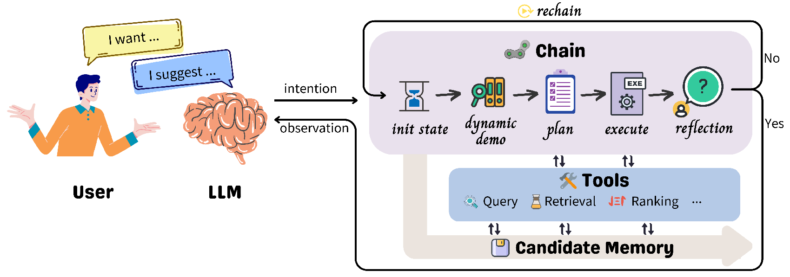

# Recommender AI Agent: Integrating Large Language Models for Interactive Recommendations
This is the Repo for InteRecAgent, a interactive recommender agent, which applies Large Language Model(LLM) to bridge the gap between traditional recommender systems and  conversational recommender system(CRS). 


## Table of Contents

- [Recommender AI Agent: Integrating Large Language Models for Interactive Recommendations](#recommender-ai-agent-integrating-large-language-models-for-interactive-recommendations)
  - [Table of Contents](#table-of-contents)
  - [InteRecAgent Framework](#interecagent-framework)
  - [Usage](#usage)
  - [Citation](#citation)


## InteRecAgent Framework
<p align="center">
  
  <br>
  <b>Figure 1</b>: InteRecAgent Framework
</p>

InteRecAgent (**Inte**ractive **Rec**ommender **Agent**) is a framework to utilize pre-trained domain-specific recommendation tools (such as SQL tools, id-based recommendation models) and large language models (LLM) to implement an interactive, conversational recommendation agent. In this framework, the LLM primarily engages in user interaction and parses user interests as input for the recommendation tools, which are responsible for finding suitable items.   
  
Within the InteRecAgent framework, recommendation tools are divided into three main categories: query, retrieval, and ranking. You need to provide the API for the LLM and the pre-configured domain-specific recommendation tools to build an interactive recommendation agent using the InteRecAgent framework. Neither the LLM nor the recommendation tools will be updated or modified within InteRecAgent.
  
This repository mainly implements the right-hand side of the figure, i.e., the communication between the LLM and the recommendation tools. For more details, please refer to our paper [*Recommender AI Agent: Integrating Large Language Models for Interactive Recommendations*](https://arxiv.org/abs/2308.16505).

InteRecAgent consists of 4 necessary components:

1. LLM: A large language model, which serves as conversational agent.
 
2. Item profile table: A table containing item informations, whose columns consists of id, title, tag, description, price, release_date, visited_num, et al.


3. Query module: A SQL module to query item information in the item profile table.
    - Input: SQL command
    - Output: information queried with SQL


4. Retrieval module: The module aims to retrieve item candidates from the all item corups according to user's intention(requirements). Note that the module does not function in deal with user's personal profile, like user history, user age, et al. Instead, it focuses on what user wants, like "give me some sports games", "I want some popular games". The module should consist of at least two kinds of retrieval tools:
    - SQL tool: The tools is used to deal with complex search condition, which is related to item information. For example, "I want some popular sports games". Then the tool would use SQL command to search in the item profile table.
        - Input: SQL command
        - Output: execution log
    
    - Item similarity tool: The tools aims to retrieve items according to item similarity. Sometimes, user's intention is not clear enough to organized as SQL command, for example, "I want some games similar with Call of Duty", where the requirements is expressed implicitly through item similarity instead of explicit item features. 
        - Input: item name list as string. 
        - Output: execution log


5. Ranking module: Refine the rank of item candidates according to schema (popularity, similarity, preference). User prefernece comprises `prefer` and `unwanted`. The module could be a traditional recommender model, which inputs user and item features and outputs relevant score.
    - Input: ranking schema, user's profile (prefer, unwanted)
    - Output: execution log


## Usage

1. Environments

    
    First, install other packages listed in `requirements.txt`

    ```bash
    cd InteRecAgent
    conda create -n interecagent python==3.9
    conda activate interecagent
    pip install -r requirements.txt
    ```

2. Prepare data resource

   For your convenience, a volunteer (thanks <a href="mailto:xuhuangcs@mail.ustc.edu.cn">Xu Huang</a> for the contribution!) has prepared a copy of ready-to-run data resources based on public dataset. Please download the resources from [GoogleDrive](https://drive.google.com/file/d/1nSw2cuoi_WEOnHRg_eIyLWGBAjHdelsg/view?usp=drive_link) / [RecDrive](https://rec.ustc.edu.cn/share/baa4d930-48e1-11ee-b20c-3fee0ba82bbd). After you unzip the all_resources.zip file, you will see three folders, corresponding to three domains. Create a folder named "resources" under "InteRecAgent" and copy the data resource to it. For example, the folder structure is like "./InteRecAgent/resources/game".

3. How to run

    - If you are using personal OpenAI API, please setup those environments:

        ```bash
        export OPENAI_API_KEY="xxxx"  
        export API_TYPE="open_ai"
        ```

    - If you are using Azure OpenAI API, please setup those environments:


        ```bash
        export OPENAI_API_KEY="xxx" 
        export OPENAI_API_BASE="xxx" 
        export OPENAI_API_VERSION="xxx" 
        export OPENAI_API_TYPE="azure"
        ```

    Then, you can launch the app with: 

    ```bash 
    DOMAIN=game python app.py --engine gpt-4
    ```

    Note that `DOMAIN` represents the item domain, e.g., `game`, `movie` and `beauty_product` in the provided data sources. Replace `gpt-4` with your own deploy name when using Azure OpenAI API. 

    We also provide a shell script `run.sh`, where commonly used arguments are given. You could directly set the API related information in `run.sh`, or create a new shell script `oai.sh` that would be loaded in `run.sh`. GPT-4 API is highly recommended for the InteRecAgent since it has remarkable instruction-following capability.

    Here is an example of the `oai.sh` script:

    ```bash
    API_KEY="xxxxxx" # your api key
    API_BASE="https://xxxx.azure.com/" # [https://xxxx.azure.com, https://api.openai.com/v1]
    API_VERSION="2023-03-15-preview"
    API_TYPE="azure" # ['open_ai', 'azure']
    engine="gpt4"   # model name for OpenAI or deployment name for Azure OpenAI. GPT-4 is recommended.
    bot_type="chat" # model type, ["chat", "completetion"]. For gpt-3.5-turbo and gpt-4, it should be "chat". For text-davinci-003, it should be "completetion" 
    ```

    Meanwhile, we support to serve local models such as Vicuna or other opensource models as the backbone language models instead of OpenAI APIs:
    
    1. Download the weights of [Vicuna](https://huggingface.co/lmsys/vicuna-7b-v1.5) from huggingface.

    2. Install `fschat` package according to [FastChat](https://github.com/lm-sys/FastChat?tab=readme-ov-file#install)

    3. Deploy the Vicuna model with OpenAI-Compatible RESTful APIs by running the following command:

        ```bash
        # First, launch the controller
        python3 -m fastchat.serve.controller
        # Then, launch the model worker(s)
        python3 -m fastchat.serve.model_worker --model-path path-to-vicuna
        # Finally, launch the RESTful API server
        python3 -m fastchat.serve.openai_api_server --host localhost --port 8000
        ```

    4. Set the configuration for local model API in `run.sh`

        ```bash
        API_KEY="EMPTY"
        API_BASE="http://localhost:8000/v1"
        API_VERSION="2023-03-15-preview"
        API_TYPE="open_ai"
        engine="vicuna-7b-v1.5"   # model name
        bot_type="completetion" # model type
        ```

    5. Run the `run.sh` script to start the chatbot.


4. Features    

    There are several optional features to enhance the agent.

    1. History Shortening

        - `enable_shorten`: if true, enable shortening chat history by LLM; else use all chat history

    2. Demonstrations Selector
        
        - `demo_mode`: mode to choose demonstration. Optional values: [`zero`, `fixed`, `dynamic`]. If `zero`, no demonstration would be used (zero-shot). If `fixed`, the first `demo_nums` examples in `demo_dir_or_file` would be used. If `dynamic`, most `demo_nums` related examples would be selected for in-context learning. 
        - `demo_dir_or_file`: the directory or file path of demostrations. If a directory path is given, all `.jsonl` file in the folder would be loaded. If `demo_mode` is `zero`, the argument is invalid. Default None.
        - `demo_nums`: number of demonstrations used in prompt for in-context learning. The argument is invalid when `demo_dir` is not given. Default 3. 

    3. Reflection

        - `enable_reflection`: if true, enable reflection for better plan making
        - `reflection_limits`: maximum times of reflection

        Note that reflection happens after the plan is finished. That means the conversational agent would generate an answer first and then do reflection.

    4. Plan First

        - `plan_first`: if true, the agent would make tool using plan first. There would only a tool executor for LLM to call, where the plan is input. Default true.

        Additionally, we have implemented a version without using the black-box API calling in langchain.
        To enable it, use the following arguments.

        - `langchain`: if true, use langchain in plan-first strategy. Otherwise, the API calls would be made by directly using openai. Default false.


## Citation
Please cite the following paper if the project helps you in anyway:

```
@article{10.1145/3731446,
        author = {Huang, Xu and Lian, Jianxun and Lei, Yuxuan and Yao, Jing and Lian, Defu and Xie, Xing},
        title = {Recommender AI Agent: Integrating Large Language Models for Interactive Recommendations},
        year = {2025},
        publisher = {Association for Computing Machinery},
        address = {New York, NY, USA},
        issn = {1046-8188},
        url = {https://doi.org/10.1145/3731446},
        doi = {10.1145/3731446},
        note = {Just Accepted},
        journal = {ACM Trans. Inf. Syst.},
        month = apr,
        keywords = {Conversational Recommendation, Large Language Models, Interactive Agents}
}
```
