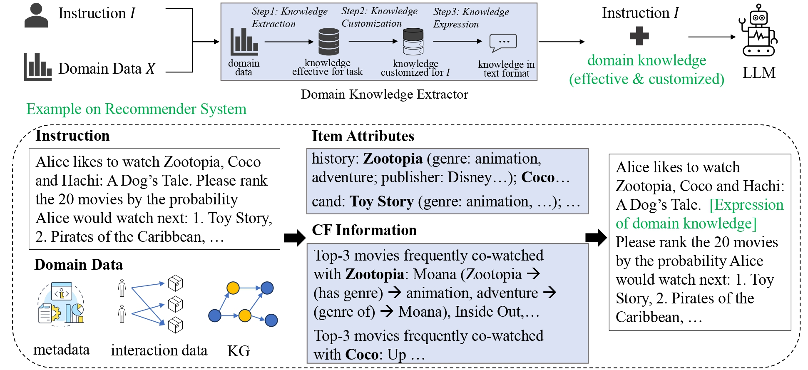

# Knowledge Plugins: Enhancing Large Language Models for Domain-Specific Recommendations
This repository contains the source code of the paper: Knowledge Plugins: Enhancing Large Language Models for Domain-Specific Recommendations.

##

## Usage
### 1. Preprocess

#### 1.1 Download and process raw data
Follow the documents and notebooks in `preprocess/step1-Raw_Dataset_Parsing` to download and process the `Amazon/Beauty`, `ML1M`, and `Online Retail` dataset.

This step will generate three files for each dataset: `sequential_data.txt`, `negative_samples.txt`, `metadata.json`.

#### 1.2 Train base recommender model
Follow the instructions outlined in `preprocess/step2-Base_models` to train recommendation models and generate collaborative filtering (CF) information from two perspectives: `MF_embedding` for Item-2-Item and `SASRec_embedding` for User-2-Item, respectively.

This step will generate two files for each dataset: `MF_embedding.pkl` and `SASRec_embedding.pkl`.

### 2. Knowledge Extraction
We consider providing CF information from two main perspectives: Item-2-Item and User-2-Item.

For each type of CF information, we extract it from the embedding and organize it into structured data for future use.

For example:
```bash
cd Knowledge_Extraction
python extract_I2I.py \
    --dataset ml1m \
    --negative_type pop
python extract_U2I.py \
    --dataset ml1m \
    --negative_type pop
```

This step will generate a series of json files for each dataset, like `global_CF.json`, `MF_CF_pop.json`, etc.

### 3. DOKE(Prompt Construction and Response Generation via API)

In the `DOKE/config` directory, we have stored all the prompt templates used in our paper. You can also refer to them to compose your own prompt templates.

With the following command, you can evaluate the recommendation performance under different settings.

```bash
cd DOKE
python generate_prompt.py \
    --config config/ml1m/popneg_his_I2I.json \
    --dataset ml1m
python call_openai.py \
    --prompt out/prompts/ml1m/popneg_his_I2I.json \
    --model ChatGPT \
    --dataset ml1m
bash metric.bash out/result/ml1m/ChatGPT_popneg_his_I2I ml1m
```


## Citation
If you find this project useful in your research, please cite our research paper:

```
@misc{yao2023knowledgepluginsenhancinglarge,
      title={Knowledge Plugins: Enhancing Large Language Models for Domain-Specific Recommendations}, 
      author={Jing Yao and Wei Xu and Jianxun Lian and Xiting Wang and Xiaoyuan Yi and Xing Xie},
      year={2023},
      eprint={2311.10779},
      archivePrefix={arXiv},
      primaryClass={cs.IR},
      url={https://arxiv.org/abs/2311.10779}, 
}
```