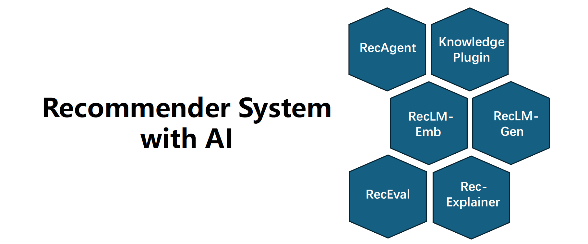

<div align="center">



</div>

<div align="center">

# RecAI: Leveraging Large Language Models for Next-Generation Recommender Systems

</div>

Large Language Models (LLMs) offer significant potential for the development of cutting-edge recommender systems, particularly in terms of enhancing interactivity, explainability, and controllability. These are aspects that have traditionally posed challenges. However, the direct application of a general-purpose LLM for recommendation purposes is not viable due to the absence of specific domain knowledge.

The RecAI project aims to bridge this gap by investigating various strategies to integrate LLMs into recommender systems, a concept people usually term as LLM4Rec. Our goal is to reflect the real-world needs of LLM4Rec through holistic views and methodologies.

We believe that by adopting a holistic perspective, we can incorporate the majority of practical requirements of LLM4Rec into one or more of the techniques explored in the RecAI project. These techniques include, but are not limited to, Recommender AI agents, the injection of knowledge through personalized prompting, fine-tuning language models as recommenders, evaluation, and LLMs as model explainers. The ultimate objective is to create a more sophisticated, interactive, and user-centric recommender system.

<div align="center" style="background-image:url(./assets/background/background.png);background-color:rgba(255, 255, 255, 0.8);background-blend-mode:overlay;background-position:right;background-repeat:no-repeat;background-size:100% 100%;">

<table>  
  <tr>  
    <td>  </td>  
    <td> 
     <strong style="font-size:3vw"> <a href="https://github.com/microsoft/RecAI/blob/main/InteRecAgent/README.md" style="color: #0000FF; text-decoration: underline;"> Recommender AI Agent </a> </strong> <br> LLMs provide natural interactions and respond smartly to human instructions but lack domain-specific expertise. In contrast, traditional recommender systems excel with in-domain data training yet are constrained to structured data and lack interactivity. InteRecAgent introduces an AI agent that combines the strengths of both: it employs an LLM as the brain and traditional recommender models as tools. Consequently, traditional models like matrix factorization can be transformed into conversational, interactive, and explainable recommender systems..
     </td>  
  </tr> 

  <tr>  
    <td>  </td>  
    <td> 
     <strong style="font-size:3vw"> <a href="https://github.com/microsoft/RecAI/blob/main/Knowledge_Plugin/README.md" style="color: #0000FF; text-decoration: underline;"> Selective Knowledge Plugin </a></strong> </br>
     How can we enhance an LLM's domain-specific ability without finetuning the model? Then the prompt is the key. In this work, we introduce a method that augments LLMs with selective knowledge, so that large-scale, continuously evolving, and domain-specific data patterns can be injected by prompt. 
     </td>  
  </tr>   

  <tr>  
    <td>  </td>  
    <td> 
     <strong style="font-size:3vw"> <a href="https://github.com/microsoft/RecAI/blob/main/RecLM-emb/README.md" style="color: #0000FF; text-decoration: underline;"> Embedding RecLM </a></strong> </br>
     Dense retrieval is a crucial component in a range of scenarios, including recommender systems and retrieval-augmented generation (RAG). While generative language models such as GPTs are designed for sequential token generation, they are not optimized for retrieval-oriented embedding. This is where our project, RecLM-emb, comes into play. RecLM-emb aligns with text-embedding models like text-embedding-ada-002, but it is specifically optimized for item retrieval. The goal is to embed everything for item retrieval. Currently it only supports text modality, such as search query, item description, and user instructions.
     </td>  
  </tr> 

  <tr>  
    <td>  </td>  
    <td> 
     <strong style="font-size:3vw"> <a href="https://github.com/microsoft/RecAI/blob/main/RecLM-gen/README.md" style="color: #0000FF; text-decoration: underline;"> Generative RecLM </a></strong> </br>
  It's important to note that data patterns vary significantly across domains, meaning a general-purpose LLM may not deliver optimized performance within a specific domain. To adapt to specific domain data patterns, grounding to domain item catalogs, and enhance instruction-following capability, this project discusses the process of fine-tuning a generative Language Model for recommenders, referred to as RecLM-gen. Techniques include supervised finetuning (SFT) and reinforcement learning (RL). Potential applications of this approach include rankers, conversational recommenders, and user simulators.
     </td>  
  </tr> 

  <tr>  
    <td>  </td>  
    <td> 
     <strong style="font-size:3vw"> <a href="https://github.com/microsoft/RecAI/blob/main/RecExplainer/README.md" style="color: #0000FF; text-decoration: underline;"> Model Explainer </a></strong> </br>
     Deep learning-based recommender systems are widely used in various online services, thanks to their superiority in effectiveness and efficiency. However, these models often lack interpretability, making them less reliable and transparent for both users and developers. In this work, we propose a new model interpretation approach for recommender systems, call RecExplainer, by using LLMs as surrogate models and learn to mimic and comprehend target recommender models.
     </td>  
  </tr> 

  <tr>  
    <td>  </td>  
    <td> 
     <strong style="font-size:3vw"> <a href="https://github.com/microsoft/RecAI/blob/main/RecLM-eval/README.md" style="color: #0000FF; text-decoration: underline;"> RecLM Evaluator </a></strong> </br>
Evaluation is crucial for assessing the true capabilities of models and identifying areas of weakness for further improvement. In the era of using language models as recommenders, which function in a human-like manner, the evaluation method has significantly deviated from traditional styles. This project intends to offer a comprehensive service for the evaluation of LM-based recommender systems. Whether provided with a trained LM or an API (such as Azure OpenAI API), it assesses the model's performance from various perspectives, including retrieval, ranking, explanation capability, and general AI ability.
     </td>  
  </tr> 
</table>  
</div>

## License
RecAI uses [MIT](./LICENSE) license. 


## Contributing

This project welcomes contributions and suggestions.  Most contributions require you to agree to a
Contributor License Agreement (CLA) declaring that you have the right to, and actually do, grant us
the rights to use your contribution. For details, visit https://cla.opensource.microsoft.com.

When you submit a pull request, a CLA bot will automatically determine whether you need to provide
a CLA and decorate the PR appropriately (e.g., status check, comment). Simply follow the instructions
provided by the bot. You will only need to do this once across all repos using our CLA.

This project has adopted the [Microsoft Open Source Code of Conduct](https://opensource.microsoft.com/codeofconduct/).
For more information see the [Code of Conduct FAQ](https://opensource.microsoft.com/codeofconduct/faq/) or
contact [opencode@microsoft.com](mailto:opencode@microsoft.com) with any additional questions or comments.

## Trademarks

This project may contain trademarks or logos for projects, products, or services. Authorized use of Microsoft 
trademarks or logos is subject to and must follow 
[Microsoft's Trademark & Brand Guidelines](https://www.microsoft.com/en-us/legal/intellectualproperty/trademarks/usage/general).
Use of Microsoft trademarks or logos in modified versions of this project must not cause confusion or imply Microsoft sponsorship.
Any use of third-party trademarks or logos are subject to those third-party's policies.


## Acknowledge

Thanks to the open source codes of the following projects:

[UniRec](https://github.com/microsoft/UniRec) &#8194;
[VisualChatGPT](https://github.com/microsoft/TaskMatrix/blob/main/visual_chatgpt.py) &#8194;
[JARVIS](https://github.com/microsoft/JARVIS) &#8194;
[LangChain](https://github.com/langchain-ai/langchain) &#8194;
[guidance](https://github.com/microsoft/guidance) &#8194;
[FlagEmbedding](https://github.com/FlagOpen/FlagEmbedding) &#8194;

## Responsible AI FAQ

Please refer to [RecAI: Responsible AI FAQ](./RAI_FAQ.md) for document on the purposes, capabilities, and limitations of the RecAI systems. 


## Citation
If this project aids your research, please cite our following paper:
#### RecAI Overview:
```
@inproceedings{10.1145/3589335.3651242,
    author = {Lian, Jianxun and Lei, Yuxuan and Huang, Xu and Yao, Jing and Xu, Wei and Xie, Xing},
    title = {RecAI: Leveraging Large Language Models for Next-Generation Recommender Systems},
    year = {2024},
    isbn = {9798400701726},
    publisher = {Association for Computing Machinery},
    address = {New York, NY, USA},
    url = {https://doi.org/10.1145/3589335.3651242},
    doi = {10.1145/3589335.3651242},
    booktitle = {Companion Proceedings of the ACM Web Conference 2024},
    pages = {1031–1034},
    numpages = {4},
    keywords = {large language models, recommender systems},
    location = {Singapore, Singapore},
    series = {WWW '24}
}
```
And corresponding paper in the subfolder:

#### InteRecAgent:
```
@article{10.1145/3731446,
    author = {Huang, Xu and Lian, Jianxun and Lei, Yuxuan and Yao, Jing and Lian, Defu and Xie, Xing},
    title = {Recommender AI Agent: Integrating Large Language Models for Interactive Recommendations},
    year = {2025},
    publisher = {Association for Computing Machinery},
    address = {New York, NY, USA},
    issn = {1046-8188},
    url = {https://doi.org/10.1145/3731446},
    doi = {10.1145/3731446},
    note = {Just Accepted},
    journal = {ACM Trans. Inf. Syst.},
    month = apr,
    keywords = {Conversational Recommendation, Large Language Models, Interactive Agents}
}
```

#### Knowledge_Plugin:
```
@misc{yao2023knowledgepluginsenhancinglarge,
      title={Knowledge Plugins: Enhancing Large Language Models for Domain-Specific Recommendations}, 
      author={Jing Yao and Wei Xu and Jianxun Lian and Xiting Wang and Xiaoyuan Yi and Xing Xie},
      year={2023},
      eprint={2311.10779},
      archivePrefix={arXiv},
      primaryClass={cs.IR},
      url={https://arxiv.org/abs/2311.10779}, 
}
```

#### RecExplainer:
```
@inproceedings{10.1145/3637528.3671802,
    author = {Lei, Yuxuan and Lian, Jianxun and Yao, Jing and Huang, Xu and Lian, Defu and Xie, Xing},
    title = {RecExplainer: Aligning Large Language Models for Explaining Recommendation Models},
    year = {2024},
    isbn = {9798400704901},
    publisher = {Association for Computing Machinery},
    address = {New York, NY, USA},
    url = {https://doi.org/10.1145/3637528.3671802},
    doi = {10.1145/3637528.3671802},
    booktitle = {Proceedings of the 30th ACM SIGKDD Conference on Knowledge Discovery and Data Mining},
    pages = {1530–1541},
    numpages = {12},
    keywords = {large language models, model explainability, recommender systems},
    location = {Barcelona, Spain},
    series = {KDD '24}
}
```

#### RecLM-cgen:
```
@article{liao2025avoid,
    title={Avoid Recommending Out-of-Domain Items: Constrained Generative Recommendation with LLMs}, 
    author={Liao, Hao and Lu, Wensheng and Lian, Jianxun and Wu, Mingqi and Wang, Shuo and Zhang, Yong and Huang, Yitian and Zhou, Mingyang and Xie, Xing},
    journal={arXiv preprint arXiv:2505.03336}
    year={2025},
}
```

#### RecLM-emb:
```
@inproceedings{10.1145/3589335.3651468,
    author = {Lei, Yuxuan and Lian, Jianxun and Yao, Jing and Wu, Mingqi and Lian, Defu and Xie, Xing},
    title = {Aligning Language Models for Versatile Text-based Item Retrieval},
    year = {2024},
    isbn = {9798400701726},
    publisher = {Association for Computing Machinery},
    address = {New York, NY, USA},
    url = {https://doi.org/10.1145/3589335.3651468},
    doi = {10.1145/3589335.3651468},
    booktitle = {Companion Proceedings of the ACM Web Conference 2024},
    pages = {935–938},
    numpages = {4},
    keywords = {item retrieval, search and recommendation, text embedding},
    location = {Singapore, Singapore},
    series = {WWW '24}
}
```

#### RecLM-gen:
```
@inproceedings{lu-etal-2024-aligning,
    title = "Aligning Large Language Models for Controllable Recommendations",
    author = "Lu, Wensheng  and Lian, Jianxun  and Zhang, Wei  and Li, Guanghua  and Zhou, Mingyang  and Liao, Hao  and Xie, Xing",
    editor = "Ku, Lun-Wei  and Martins, Andre  and Srikumar, Vivek",
    booktitle = "Proceedings of the 62nd Annual Meeting of the Association for Computational Linguistics (Volume 1: Long Papers)",
    month = aug,
    year = "2024",
    address = "Bangkok, Thailand",
    publisher = "Association for Computational Linguistics",
    url = "https://aclanthology.org/2024.acl-long.443/",
    doi = "10.18653/v1/2024.acl-long.443",
    pages = "8159--8172",
}
```