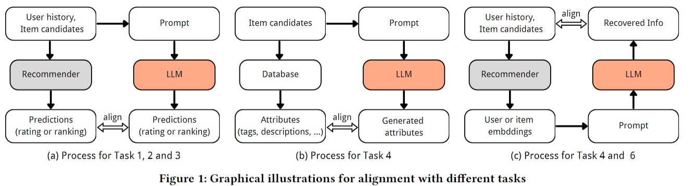

# RecExplainer: Aligning Large Language Models for Explaining Recommendation Models
This is the Repo for our KDD2024 paper: [RecExplainer: Aligning Large Language Models for Explaining Recommendation Models](https://arxiv.org/abs/2311.10947), which leverages LLMs as surrogate models for explaining black-box recommender models.


## Introduction
RecExplainer is a framework designed to align LLMs for understanding and explaining target recommender models. This framework comprises two main components：The target recommender model, which is used to recommend items according to user preferences; The LLM, which serves as a surrogate model to mimick the behavior of the target recommender model and then explain such behavior in natural language.

To utilize the RecExplainer framework effectively, one must begin by training a target recommender model. This model not only serves as the black-box model to be explained, but also plays a crucial role in generating training and testing datasets for the LLM. We have crafted a suite of tasks to make the LLM better aligned with the predictive patterns of the target recommender model as well as the domain-specific knowledge: next item retrieval (task1), item ranking (task2), interest classification (task3), item discrimination (task4), history reconstruction (task6).

For training the LLM, we introduce three distinct alignment approaches:
1. Behavior alignment (RecExplainer-B): Operate in the language space, representing user preferences and item information as text to mimic the target model’s behavior.
2. Intention alignment (RecExplainer-I): Work in the latent space of the recommendation model, using user and item representations to understand the model’s behavior.
3. Hybrid alignment (RecExplainer-H): Combine both language and latent spaces.

Our evaluation of the RecExplainer framework is two-fold:
1. Alignment effect: Reflect the extent to which LLM understands the neurons and predictive pattern in the target model. 
2. Explanation Generation Ability
    * Overall ratings: We use both GPT4 and human experts to annotate the quality of generated explanations.
    * Distinction and Coherence: We also train a classifier and a score predictor to further verify whether RecExplainer are indeed explaining its own predictions.

## Environment Setting

### Environment
```bash
conda create -n recexplainer python==3.10.14
conda activate recexplainer
conda install pytorch==2.3.1 torchvision==0.18.1 torchaudio==2.3.1 pytorch-cuda=11.8 -c pytorch -c nvidia
pip install -r requirements.txt
```

### Set OpenAI API Environment
If you want to use OpenAI API, you need to firstly run the following scripts in your console. If it is not Azure OpenAI API (OPENAI_API_TYPE is not "azure"), you only need to specify OPENAI_API_KEY and MODEL.

```bash
export OPENAI_API_KEY=xxx;
export OPENAI_API_BASE=https://xxx.openai.azure.com/;
export OPENAI_API_VERSION=2023-03-15-preview;
export OPENAI_API_TYPE=azure;
export MODEL=xxx;
```

We also support AzureCliCredential login:
```bash
az login
export OPENAI_API_BASE=https://xxx.openai.azure.com/;
export OPENAI_API_VERSION=2023-03-15-preview;
export MODEL=xxx;
```


## Dataset Preparation for Target Recommender Model
For data preparation, you need to download three raw files: Amazon review, Amazon metadata, ShareGPT, and put them under `$HOME/RecAI/RecExplainer/data/amazon_video_games_v3/raw_data`:
* Amazon Video Games 5-core reviews: https://jmcauley.ucsd.edu/data/amazon_v2/categoryFilesSmall/Video_Games_5.json.gz
* Amazon Video Games metadata: https://jmcauley.ucsd.edu/data/amazon_v2/metaFiles2/meta_Video_Games.json.gz
* ShareGPT: https://huggingface.co/datasets/anon8231489123/ShareGPT_Vicuna_unfiltered/blob/main/ShareGPT_V3_unfiltered_cleaned_split.json

Then, run the following script to prepare data for training your target recommender models.
```bash
bash shell/preprocess_recmodel.sh
```

Clone the [UniRec](https://github.com/microsoft/UniRec) repo to $HOME/UniRec and install another virtual environment for UniRec, then run the following script to convert the data format according to UniRec requirements.
```bash
bash shell/unirec_prepare_data.sh
```

## Training and Inference with the Target Recommender Model
### Training
Currently we support both SASRec model and MF model, you can train them respectively.
```bash
bash shell/unirec_sasrec_train.sh
bash shell/unirec_mf_train.sh
```

### Inference
You need to copy some files to the UniRec directory in advance.
```bash
cp preprocess/unirec_utils/data4Exp.py $HOME/UniRec/unirec/main
cp $HOME/RecAI/RecExplainer/data/unirec_raw_data/amazon_video_games_v3/train_ids.csv $HOME/UniRec/data/amazon_video_games_v3
cp $HOME/RecAI/RecExplainer/data/unirec_raw_data/amazon_video_games_v3/test_ids.csv $HOME/UniRec/data/amazon_video_games_v3
```
For SASRec model:
```bash
bash shell/unirec_sasrec_infer.sh
```
After inference, please copy the contents of `$HOME/UniRec/output/amazon_video_games_v3/SASRec/RecExplainer/xxx/` to `$HOME/RecAI/RecExplainer/data/amazon_video_games_v3`

Finally, there should exist these files in `$HOME/RecAI/RecExplainer/data/amazon_video_games_v3`: datamaps.json, metadata.json, SASRec.pth, sequential_data.txt, sim_item.txt, test_top.txt, train_top.txt

For MF model:
```bash
bash shell/unirec_mf_infer.sh
```
After inference, please copy the contents of `$HOME/UniRec/output/amazon_video_games_v3/MF/RecExplainer/xxx/` to `$HOME/RecAI/RecExplainer/data/mf_amazon_video_games_v3`

At the same time, copy these files from `$HOME/RecAI/RecExplainer/data/amazon_video_games_v3` to `$HOME/RecAI/RecExplainer/data/mf_amazon_video_games_v3`: datamaps.json, metadata.json, sequential_data.txt

Finally, there should exist these files in `$HOME/RecAI/RecExplainer/data/mf_amazon_video_games_v3`: datamaps.json, metadata.json, MF.pth, sequential_data.txt, sim_item.txt, test_top.txt, train_top.txt

## Dataset Preparation for RecExplainer Model
```bash
bash shell/recexplainer_data_pipeline.sh
```
After running the above script, you will get the following training and testing files for both SASRec and MF model:

For alignmen tasks
* `behaviour_train.json` & `behaviour_valid.json`: data for training and testing RecExplainer-B (behavior alignmet), also used to test the alignment performance of open source LLMs.
* `intention_train.json` & `intention_valid.json`: data for training and testing RecExplainer-I (intention alignment).
* `both_train.json` & `both_valid.json`: data for training and testing RecExplainer-H (hybrid alignment).

For explanation tasks
* `explan_behaviour_valid.json`: prompts for RecExplainer-B to generate explanations.
* `explan_intention_valid.json`: prompts for RecExplainer-I to generate explanations.
* `explan_both_valid.json`: prompts for RecExplainer-H to generate explanations.
* `explan_chatgpt_valid.csv`: prompts for ChatGPT to generate explanations.

Note: Files such as `explain_behaviour_train.json` are also used to generate explanations. After generation, we'll use them to train our score predictors as well as classifiers. See Section [Distinction and Coherence](#custom-anchor) for more information.

## Train RecExplainer
```bash
bash shell/train.sh
```

Important Parameters:
- `--rec_model_type`: The type of the target recommender model. We currently support "SASRec" and "MF".
- `--task_type`: Alignment method of the training stage. "behaviour" means behavior aligment, "intention" means intention aligment, "both" means hybrid aligment.
- `--template_name`: The chat template of the LLM. We currently support "mistral"/"vicuna"/"llama-2"/"llama-3"/"phi3".

After training, you need to merge lora adapters into the base model.
```bash
bash shell/merge.sh
```

## Evaluation
### Alignment Effect
```bash
bash shell/infer_alignment.sh
```

Parameters:
- `--task_type`: alignment method used by the model. "behaviour" means behavior aligment, "intention" means intention aligment, "both" means hybrid aligment, "none" means using LLM without alignment training.
- `--inference_mode`: the name of the inference task. "iid2title" means item recovery task, "uid2hist" means history reconstruction task, "uid2next" means next item retrieval task, "uidiid2rank" means item ranking task, "uidiid2binary" means interest classification task.

### Explanation Generation Ability

#### Generating Explanations with Aligned RecExplainer Model
```bash
bash shell/infer_explan.sh
```

Parameters:
- `--task_type`: alignment method used by the model. "behaviour" means behavior aligment, "intention" means intention aligment, "both" means hybrid aligment, "none" means using LLM without alignment training.
- `--inference_mode`: the name of the inference task. "case study" means generating explanation texts.


After using different models to generate explanation texts, we can evaluate the quality of the explanations and finally compare the performance of different models on explanation generation task.

#### Overall ratings
We use GPT4 to score the explanations generated by each model.

```bash
bash shell/eval_explan.sh
```

Parameters:
- `--model_names`: Models used to generate explanations. Use commas to separate different model names.
- `--model_response_files`: Explanation Files generated by each model. Use commas to separate different files.
- `--judge_query_file`: Input file of gpt4
- `--judge_response_file`: Output file of gpt4


#### Distinction and Coherence <a id="custom-anchor"></a>
We train a classifier and a score predictor to further verify whether RecExplainer are indeed explaining its own predictions.

**Data generation**
```bash
bash discriminator/data_gen.sh
```

**Train a classifier**

The classifier aims to verify whether RecExplainer’s explanations are distinct from other LLM’s explanations.

```bash
bash discriminator/run_cls.sh
```

**Train a score predictor**

The score predictor aims to verify whether RecExplainer’s explanations reflect RecExplainer’s predictions.
```bash
bash discriminator/run_reg.sh
```

## Citation
If you find this project useful in your research, please consider citing:

```
@inproceedings{10.1145/3637528.3671802,
        author = {Lei, Yuxuan and Lian, Jianxun and Yao, Jing and Huang, Xu and Lian, Defu and Xie, Xing},
        title = {RecExplainer: Aligning Large Language Models for Explaining Recommendation Models},
        year = {2024},
        isbn = {9798400704901},
        publisher = {Association for Computing Machinery},
        address = {New York, NY, USA},
        url = {https://doi.org/10.1145/3637528.3671802},
        doi = {10.1145/3637528.3671802},
        booktitle = {Proceedings of the 30th ACM SIGKDD Conference on Knowledge Discovery and Data Mining},
        pages = {1530–1541},
        numpages = {12},
        keywords = {large language models, model explainability, recommender systems},
        location = {Barcelona, Spain},
        series = {KDD '24}
}
```

## Acknowledge
Thanks to the open source codes of [UniRec](https://github.com/microsoft/UniRec).