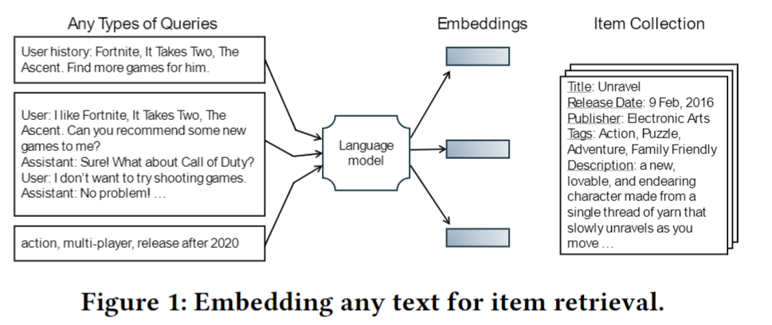

# Aligning Language Models for Versatile Text-based Item Retrieval
<!-- This is the Repo dedicated to unlocking the full potential of existing language models for the purpose of item retrieval. To begin with, you need to create a specialized fine-tuning dataset designed for item retrieval, encompassing ten distinct types of tasks. Then, you can train and test multiple types of models (Huggingface LMs/LLMs, Openai Models) on the dataset. -->
<!-- Item retrieval is a crucial component of recommender systems and search engines. However, general-purpose text embedding models often fall short of achieving satisfactory zero-shot performance for specific tasks like item retrieval. The main reason for their suboptimal performance is that these models tend to produce general semantic representations for text similarity, focusing less on tailoring information to represent relevant items mentioned within the text and disregarding other unrelated details.  In the meanwhile, with the emergence of LLMs, the query for item retrieval can come in various formats, including dialogues, detailed descriptions, formatted instructions, or unstructured and sparse attributes. Therefore, this repo aims to refine a general-purpose text embedding model to encode anything in text for item retrieval.

Specifically, users should provide two raw files: metadata.json and sequential_data.txt. This repo will first generate training samples of different formats, and then start the finetuning process. We propose ten distinct tasks to form a comprehensive dataset.
- User History (UH2I): The query is represented by the behavior history of a user.
- Item (I2I): The query is represented by a source item, searching for similar items.
- User Summary (US2I): The query is a summary about the user based on his behavior history.
- Full Attributes (FA2I): The query is a concatenation of the complete attributes of the item.
- Sparse Attributes (SA2I): The query is a concatenation of a few randomly sampled attributes of the item.
- Attributes Summary (AS2I): The query is a brief summary of the item mimicking the unique tone of users.
- Name Misspell (NM2I): The query is represented by an item name with several plausible misspellings.
- Vague Condition (VC2I): The query is represented by vague terms which are not the precise attributes of any item.
- Negative Attributes (NA2I): The query is used to search items lacking certain features.
- User History and Query (UQ2I): The query is a combination of implicit preferences and explicit intents.

The finetuned LMs can process input texts in the above formats and more, thereby performing embedding-based item matching. -->

Item retrieval is a crucial component of recommender systems and search engines. With the emergence of LLMs, the query for item retrieval can come in various formats, including dialogues, detailed descriptions, formatted instructions, or unstructured and sparse attributes. However, general-purpose text embedding models often obtain suboptimal performance for specific tasks like item retrieval. Therefore, this repo aims to refine a general-purpose text embedding model to encode anything in text for item retrieval. 

Specifically, users should provide two raw files: metadata.json (containing metadata of all items) and sequential_data.txt (containing user behaviors). This repo will use the two raw files to generate training samples of different formats, and then start the finetuning process. 

After finetuning, you can use the finetuned LM to perform embedding-based item retrieval. Figure 1 gives some examples. On the query side, the finetuned LM can encode multiple types of queries such as implicit preferences, explicit intents and dialogues. On the item side, we use fixed-format item texts.

For more details, please refer to our paper [Aligning Language Models for Versatile Text-based Item Retrieval](https://arxiv.org/abs/2402.18899).



## Usage


### Environment
```bash
conda create -n RecLM_emb python=3.10
conda activate RecLM_emb
conda install pytorch torchvision torchaudio pytorch-cuda=11.8 -c pytorch -c nvidia
pip install -r requirements.txt
```

### Set OpenAI API Environment
If you want to use OpenAI API, you need to firstly run the following scripts in your console. If it is not Azure OpenAI API (OPENAI_API_TYPE is not "azure"), you only need to specify OPENAI_API_KEY and MODEL.

```bash
export OPENAI_API_KEY=xxx;
export OPENAI_API_BASE=https://xxx.openai.azure.com/;
export OPENAI_API_VERSION=2023-03-15-preview;
export OPENAI_API_TYPE=azure;
export MODEL=xxx;
```

We also support AzureCliCredential login:
```bash
az login
export OPENAI_API_BASE=https://xxx.openai.azure.com/;
export OPENAI_API_VERSION=2023-03-15-preview;
export MODEL=xxx;
```

### Prepare your dataset
For data preparation, you must provide the following two raw files:
1. metadata.json  
This file contains the meta information of each item. Each line is a JSON object and must contain a "title" field as the natural language to represent this item. The row number corresponds to the id of the item, counting from 1.

    Format:
    ```
    {"title": "item title 1", "tags": ["tag1", "tag2"]}
    {"title": "item title 2", "tags": ["tag3", "tag4"]}
    ```
    Currently supported fileds:
    - `title` (alias: `TitleName`, `app_name`) [required]: The name of the item
    - `tags` (alias: `GPT_tags`, `popular_tags`, `genres`) [optional] : The tags of the item
    - `game_details` (alias: `specs`) [optional] : The game details of the item
    - `publisher` (alias: `PublisherCurated`) [optional] : The publisher of the item
    - `developer` (alias: `DeveloperCurated`) [optional] : The developer of the item
    - `PrimaryGenre` [optional] : The primary genre of the item
    - `SubGenre` [optional] : The sub genre of the item
    - `price` (alias: `SuggestPrice`) [optional] : The price of the item
    - `release_date` (alias: `ReleaseDateCurated`) [optional] : The release date of the item
    - `description` (alias: `ProductDescription`, `desc_snippet`, `game_description`) [optional] : The description of the item


2. sequential_data.txt  
This file contains the sequence of user-item interactions. Each line is a space-separated string. Both userid and itemid start counting from 1.

    Format:
    ```
    userid_1 itemid_11 itemid_12 ...
    userid_2 itemid_21 itemid_22 ...
    ```

The Steam dataset used in our paper is a simple combination of https://cseweb.ucsd.edu/~jmcauley/datasets.html#steam_data, https://github.com/kang205/SASRec/blob/master/data/Steam.txt and https://www.kaggle.com/datasets/trolukovich/steam-games-complete-dataset. Fortunately, a [volunteer](https://github.com/Micheallei) has gone through the data preprocess and put a copy in https://drive.google.com/drive/folders/1XhC7mybUOXDUrWyOMEvF7GP6AL676rWi?usp=sharing for reproducing experiments. Please unzip it to the ./data/ folder.

Next, you can follow the scripts to create training and testing datasets.

```bash
bash shell/data_pipeline.sh
bash shell/test_data_pipeline.sh
```

### Training
#### single node
```bash
bash shell/run_single_node.sh
```
- `--nproc_per_node`: the number of GPUs on your machine
#### multi node
If you have two nodes: node0 and node1 (here we use node0 as the master node), you should first run `deepspeed utils/all_reduce_bench_v2.py` to get IP and port number of the master node. Then run the following script on both nodes using the same IP and port number but different node ranks.

```bash
bash shell/run_multi_node.sh (node rank, such as 0 or 1) (IP) (port number + 1)
```

### Inference

#### Inference on test set
You can run the following script to quantitatively evaluate the performance of your finetuned models on embedding-based item retrieval.

```bash
bash shell/infer_metrics.sh
```
Note that for the [repllama](https://huggingface.co/castorini/repllama-v1-7b-lora-passage) model, use the following script instead.
```bash
bash shell/infer_llm_metrics.sh
```
- `--config_file`: Indicate the code running environment. `./shell/infer_case.yaml` and `./shell/infer.yaml` are provided as references for single-gpu inference and multi-gpu inference respectively.

#### Case study
You need to first prepare your query file with the suffix .jsonl (use `user_embedding_prompt_path` parameter to specify), an example is as follows:
```json
{"text": "I'd like to find some shooting games that are not made for kids and not 2D platformers"}
{"text": "I'm looking for a sports game, with high quality graphics and soundtrack, released after 2021"}
```

Then, run the following script:
```bash
bash shell/infer_case.sh
```

#### Serving with Web GUI
We also provide an interface for interactively entering a query to retrieve relevant items.

```bash
bash shell/demo.sh
```


## Citation
If you find this project useful in your research, please cite our research paper:

```
@inproceedings{10.1145/3589335.3651468,
        author = {Lei, Yuxuan and Lian, Jianxun and Yao, Jing and Wu, Mingqi and Lian, Defu and Xie, Xing},
        title = {Aligning Language Models for Versatile Text-based Item Retrieval},
        year = {2024},
        isbn = {9798400701726},
        publisher = {Association for Computing Machinery},
        address = {New York, NY, USA},
        url = {https://doi.org/10.1145/3589335.3651468},
        doi = {10.1145/3589335.3651468},
        booktitle = {Companion Proceedings of the ACM Web Conference 2024},
        pages = {935–938},
        numpages = {4},
        keywords = {item retrieval, search and recommendation, text embedding},
        location = {Singapore, Singapore},
        series = {WWW '24}
}
```
