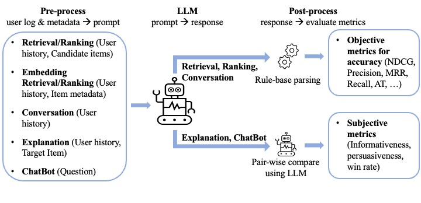

# Overview
This is a project to evaluate how various LLMs perform on recommendation tasks, including retrieval, ranking, explanation, conversation, and chatbot ability. The whole workflow is depicted as the following:


# Quick start

1. **Download Steam Data**:  
   [Download link](https://drive.google.com/file/d/1745XoSvkSG2C_1WOFM6PV6DjezrlXa8z/view?usp=drive_link)  
   Unzip to `./data/` folder.

    ```bash
    unzip path_to_downloaded_file.zip -d ./data/
    ```

2. **Navigate to Project**:  
    ```bash
    cd RecLM-eval
    ```

3. **Configure API**:  
   Edit `openai_api_config.yaml`, add your API key:

    ```yaml
    API_BASE: "if-you-have-different-api-url"
    API_KEY: "your-api-key"
    ```

4. **Run**:  
    ```bash
    bash main.sh
    ```

# Usage

## Environment
```bash
conda create -n receval python==3.9
conda activate receval
pip install -r requirements.txt
```

## Set OpenAI API Environment
* If you want to use the OpenAI API, you need to fill in your API key in the openai_api_config.yaml file.
* If you are using models not pre-defined in the project, add their cost information to the api_cost.jsonl file.
## Prepare your test data
* For data preparation details, please refer to [[preprocess]](preprocess/data-preparation.md).
* For you convenience, there is a toy example dataset derived from the Steam dataset (A simple combination of https://cseweb.ucsd.edu/~jmcauley/datasets.html#steam_data, https://github.com/kang205/SASRec/blob/master/data/Steam.txt and https://www.kaggle.com/datasets/trolukovich/steam-games-complete-dataset). 
* Please download it from (https://drive.google.com/file/d/1745XoSvkSG2C_1WOFM6PV6DjezrlXa8z/view?usp=drive_link) and unzip it to the ./data/ folder.

## Evaluate
* You can specify the evaluation tasks through the `task-names` parameter. 
* These values are avaliable: `ranking`, `retrieval`, `explanation`, `conversation`, `embedding_ranking`, `embedding_retrieval`, `chatbot`.


### Ranking/Retrieval
Parameters:
- `--bench-name`: The name of the dataset
- `--model_path_or_name`: The path or name of the evaluated model.

example:
```bash
python eval.py --task-names ranking retrieval \
    --bench-name steam \
    --model_path_or_name Qwen/Qwen2.5-7B-Instruct
```
optional parameters (only for vllm model):
-  `--max_new_tokens MAX_NEW_TOKENS`: The maximum number of tokens to generate, prompt+max_new_tokens should be less than your model's max length.
-  `--batch_size BATCH_SIZE`: The batch size during inference.

### Embedding ranking/retrieval
Parameters:
- `--bench-name`: The name of the dataset
- `--model_path_or_name`: The path or name of the evaluated model.
- `--user_emb_type`: The prompt type for user embedding(title or summary).
- `--item_emb_type`: The prompt type for item embedding(title or description).
- `--summary-model`: The name of the model used to summary user preference.

Example:
```bash
python eval.py --task-names embedding_ranking embedding_retrieval \
    --model_path_or_name text-embedding-3-small \
    --bench-name steam \
    --user_emb_type title \
    --item_emb_type title

python eval.py --task-names embedding_ranking embedding_retrieval \
    --model_path_or_name text-embedding-3-small \
    --bench-name steam \
    --user_emb_type summary \
    --summary-model gpt-3.5-turbo \
    --item_emb_type title
```

###  chatbot ability
Parameters:
- `--model_path_or_name`: The path or name of the evaluated model.
- `--baseline-model`: The path or name of the model acts as a baseline during pairwise evaluation.
- `--judge-model`: The path or name of the model used to perform judge during pairwise evaluation.

example:
```bash
python eval.py --task-names chatbot \
    --model_path_or_name Qwen/Qwen2.5-7B-Instruct \
    --judge-model gpt-3.5-turbo \
    --baseline-model gpt-3.5-turbo
```

### Explanation
Parameters:
- `--bench-name`: The name of the dataset
- `--model_path_or_name`: The path or name of the evaluated model.
- `--baseline-model`: The path or name of the model acts as a baseline during pairwise evaluation.
- `--judge-model`: The path or name of the model used to perform judge during pairwise evaluation.
```bash
python eval.py --task-names explanation \
    --bench-name steam \
    --model_path_or_name Qwen/Qwen2.5-7B-Instruct \
    --judge-model gpt-3.5-turbo \
    --baseline-model gpt-3.5-turbo
```

### Conversation
Parameters:
- `--bench-name`: The name of the dataset
- `--model_path_or_name`: The path or name of the evaluated model.
- `--simulator-model`: The path or name of the model acts as a user simulator during conversation.
- `--max_turn`: The max turns of the conversation.
example:
```bash
python eval.py --task-names conversation \
    --bench-name steam \
    --model_path_or_name Qwen/Qwen2.5-7B-Instruct \
    --simulator-model gpt-3.5-turbo \
    --max_turn 5
```